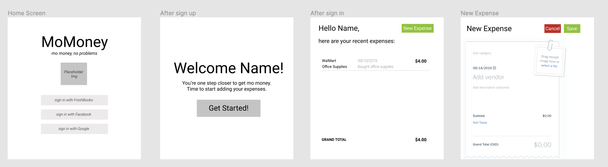
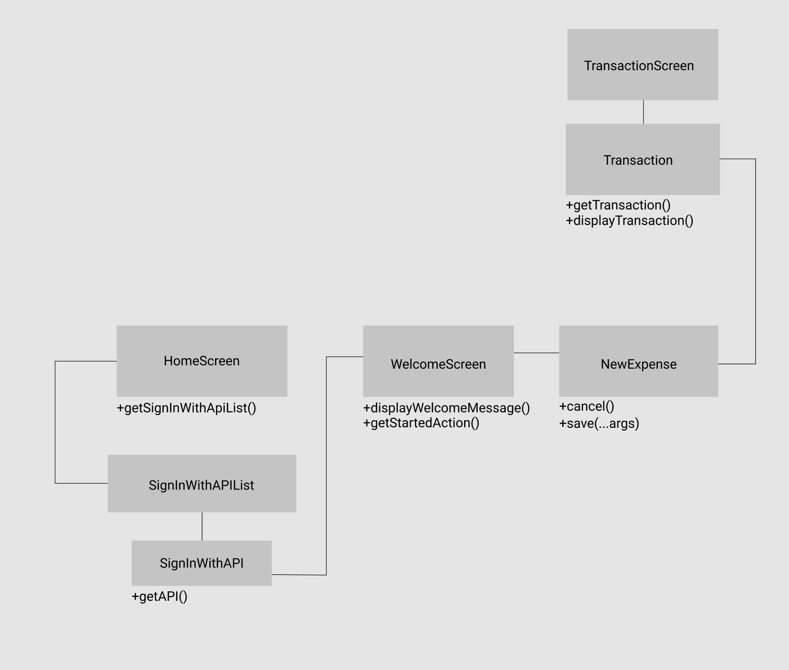

## HOW TO RUN LOCALLY (ON MAC)

1. Install npm (included with nvm) [Instructions](https://nodesource.com/blog/installing-node-js-tutorial-using-nvm-on-mac-os-x-and-ubuntu/)  

2. Install Ember `npm install -g ember-cli`

3. Clone this repo with `git clone`  

4. Go into project directory `cd momoney-htn2019`  

5. Compile and launch the localhost server `ember server`  

6. Open `http://localhost:4200` in Chrome to see the website
  
## Wireframes and UML

## Further Reading / Useful Links

* [ember.js](https://emberjs.com/)
* [ember-cli](https://ember-cli.com/)
* Development Browser Extensions
  * [ember inspector for chrome](https://chrome.google.com/webstore/detail/ember-inspector/bmdblncegkenkacieihfhpjfppoconhi)
  * [ember inspector for firefox](https://addons.mozilla.org/en-US/firefox/addon/ember-inspector/)
